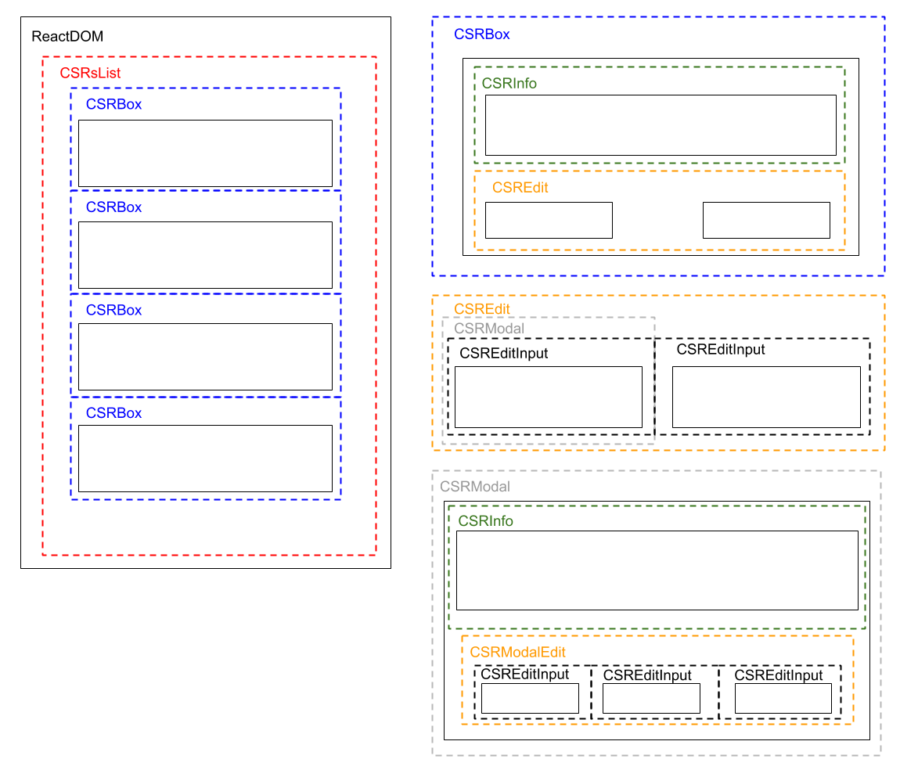

# Enroller UI

This is the enroller user interface, developed using React and Material UI technologies. The UI is deployed using NGINX Server in port 80 mapped to host port 88.

## Enroller UI React Components

## Set Up and Run

docker container run -d --network enroller-net -p 88:80 --name enrollerui enroller-ui:latest
